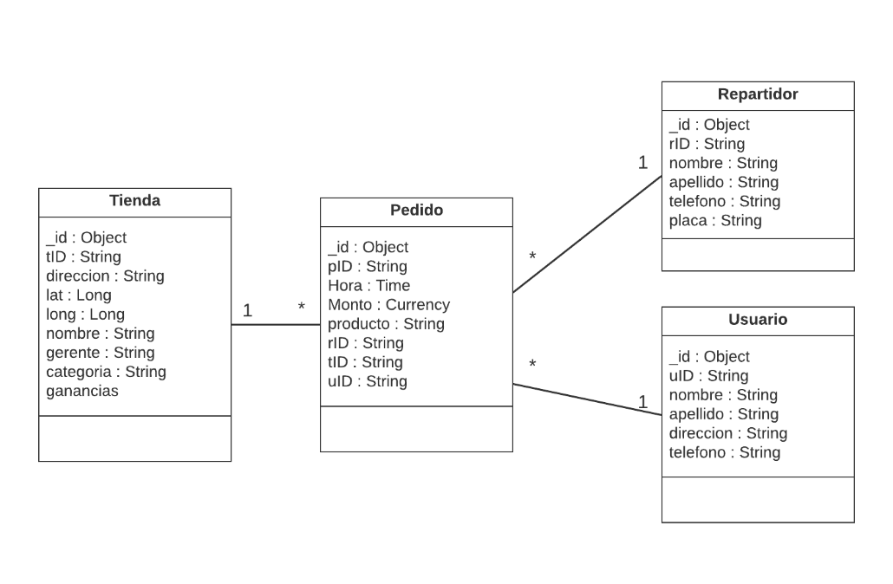

# Tarea 3. Bases de datos NoSQL (MongoDB)

---

##### Integrantes:
1. *Daniel Roa* - *A01021960* - *Campus Santa Fe*
2. *Camila Rovirosa* - *A01024192* - *Campus Santa Fe*
3. *Julio Villazón* - *A01370190* - *Campus Santa Fe*

---
## 1. Aspectos generales

Las orientaciones de la tarea se encuentran disponibles en la plataforma **Canvas**.

Este documento es una guía sobre qué información debe entregar como parte de la tarea, qué requerimientos técnicos debe cumplir y la estructura que debe seguir para organizar su entrega.


### 1.1 Requerimientos técnicos

A continuación se mencionan los requerimientos técnicos mínimos de la tarea, favor de tenerlos presente para que cumpla con todos.

* El equipo tiene la libertad de elegir las tecnologías de desarrollo a utilizar en la tarea, sin embargo, debe tener presente que la solución final se deberá ejecutar en una plataforma en la nube. Puede ser  [Google Cloud Platform](https://cloud.google.com/?hl=es), [Azure](https://azure.microsoft.com/en-us/), [AWS](https://aws.amazon.com/es/free/) u otra.
* La arquitectura de la solución deberá estar separada claramente por capas (*frontend*, *backend*, datos y almacenamiento).
* Todo el código, *scripts* y la documentación de la tarea debe alojarse en este repositorio de GitHub, siguiendo la estructura que aparece a continuación.

### 1.2 Estructura del repositorio

El proyecto debe seguir la siguiente estructura de carpetas:
```
- / 			        # Raíz de toda la tarea
    - README.md			# Archivo con la información general de la tarea (este archivo)
    - frontend			# Carpeta con la solución del frontend (Web app)
    - backend			# Carpeta con la solución del backend (API)
    - scripts		        # Carpeta con los scripts necesarios para generar la base de datos, cargar datos y ejecutar las consultas
    - database			# Carpeta con el modelo de la bases de datos utilizando JSON Schema

```

### 1.3 Documentación de la tarea

Como parte de la entrega de la tarea, se debe incluir la siguiente información:

* Diagrama del *Modelo de la base de datos utilizando JSON Schema*.
* *Scripts* para generar la base de datos, cargar datos y ejecutar consultas.
* Guía de configuración, instalación y despliegue de la aplicación en la plataforma en la nube  seleccionada.
* El código debe estar documentado siguiendo los estándares definidos para el lenguaje de programación seleccionado.

## 2. Solución

A continuación aparecen descritos los diferentes elementos que forman parte de la solución de la tarea.

### 2.1 Modelo de la *base de datos* 

Al construir el model de nuestra base de datos en MongoDB, planeamos que se llamara __rappi__, debido a que esta siendo inspirada por el servicio que proporciona. Dentro de esta base, creamos cuatro colecciones:
* pedido
* repartidor
* tienda
* usuario

El JSON Schema de estos se ve de la siguiente manera:


También, puede ser encontrado en formato JSON [aquí](./scripts/DBSchema.json).

### 2.2 Arquitectura de la solución



### 2.3 Frontend

Para poder llevar a cabo el frontend, primero se modeló el diseño en _html_ y se utilizó como base.

Al tener una idea de como se vería/funcionaría la página, se movieron para que funcione con node y, se cambió el formato para que, en lugar de que las páginas tuvieran terminación _.html_, tuvieran terminación __.edge__.

Este cambio nos permitió dejar un formato preparado y, posteriormente, mantener un formato general para todas las páginas que fueron creadas e implementadas.

#### 2.3.1 Lenguaje de programación

La página web (la visualización), fue programada originalmente en html, pero una vez que se empezó a llevar a cabo en node, se cambio el tipo de texto, __no__ el lenguaje.

Como se mencionó posteriormente, se cambió para que utilizara el módulo de node.js llamado __edge.js__. Este nos permite usar datos que ya teníamos en la página de html y, de tal manera, nos aseguramos que la página siga corriendo y el formato que se le programó, se mantenga por igual.

#### 2.3.2 Framework

Para la programación del frontend, no se utilizó ningún tipo de framework.

Si se utilizaron modulos de node, pero esos se tocan en la sección de __Backend__.

#### 2.3.3 Librerías de funciones o dependencias

Para la sección del frontend, no se utilizó ninguna librería.

Todos los datos que despliega son mandados a llamar desde el código encontrado en [index.js](/backend/index.js) y será explicado en la sección de __Backend__.

### 2.4 Backend

Para poder llevar a cabo el _backend_ de esta aplicación, se utilizaron librerías de node y se programo completamente usando node.js.

Para poder desplegar la aplicación web, se tenía planeado utilizar el servicio de Microsoft Azure, pero no detectaba la página de manera correcta.
Por esto mismo, cambiamos a Amazon Web Services (__AWS__), este cambio ayudó a que el despliegue de la página web fuera más rápido que el despliegue que se intentó llevar a cabo en Azure.

La página donde se encuentra la aplicación web es: 

ec2-18-222-4-166.us-east-2.compute.amazonaws.com:3000

* Las páginas de apoyo se encuentran en la sección de _Referencias_.

#### 2.4.1 Lenguaje de programación

Debido a que Node.js funciona con _JavaScript_, todo lo que consiste en el backend, fue llevado a cabo utilizando documentos .js.

El uso de node.js, nos permitió implementar librerías para que la página cumpliera con las funcionalidades que fueron solicitadas.

#### 2.4.2 Framework

No se utilizó ningún framework para llevar a cabo el backend, todas las operaciones fueron programadas y probadas por nosotros.

#### 2.4.3 Librerías de funciones o dependencias

Debido al uso de Node, tuvimos que instalar las siguientes librerías:

* body-parse
** 
* edge.js
** Nos permitió dejar un formato predefinido para los documentos que visualizan nuestra página web.
* express
** Nos permitió correr el index.js usando el comando `npm start`
* mongodb
** No proporciona el uso de las operaciones encontradas en MongoDB.

Muchas de estas librerías fueron utilizadas para poder desplegar y visualizar correctamente la aplicación de manera correcta.

## 2.5 Pasos a seguir para utilizar la aplicación

Para poder utilizar la aplicación, se necesita una terminal que permita correr comandos de Git, comandos de node, acceso a una red y acceso a la base de datos (en caso que se quiera ver que las inserciones se esten realizando correctamente).

_Pasos a seguir_

Primero, se necesita correr el comando:

`git clone https://github.com/tec-csf/tc3041-t3-primavera-2020-equipo3.git`

Una vez que se haya descargado el repositorio, se tendrán las siguientes carpetas:
* frontend
* backend
* scripts
* database

Para poder correr la aplicación de manera local, es necesario correr los siguiente comandos en su terminal:

`
cd tc3041-t3-primavera-2020-equipo3\backend
`

`
npm start
`

El primer comando se encarga de transferir al usuario a la carpeta llamada _tc3041-t3-primavera-2020-equipo3_ y posteriormente a la carpeta llamada _backend_. 

Esto va a poner al usuario en la carpeta correcta para poder correr el comando `npm start`, esto permite que la aplicación empiece a correr en el puerto _4000_ de la computadora del usuario.

En otras palabras, si el usuario busca <http://localhost:4000/home> en su navegador (IE, Firefox, Chrome, etc...), lo va a llevar a la página _home_ de la aplicación.

**NOTA**:
*  _En esta guía se está asumiendo que el usuario ya tiene node instalado en su computadora._

## 3. Referencias

*[Incluya aquí las referencias a sitios de interés, datasets y cualquier otra información que haya utilizado para realizar la tarea y que le puedan ser de utilidad a otras personas que quieran usarlo como referencia]*
